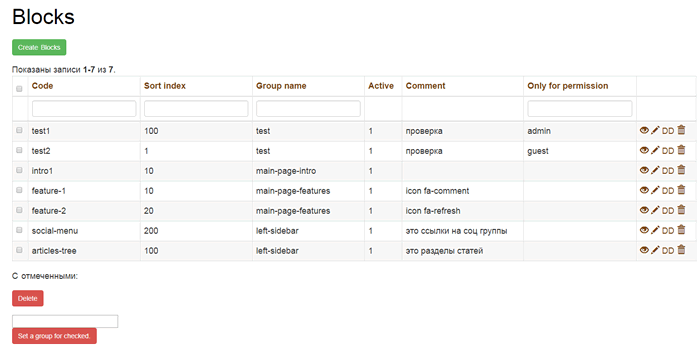
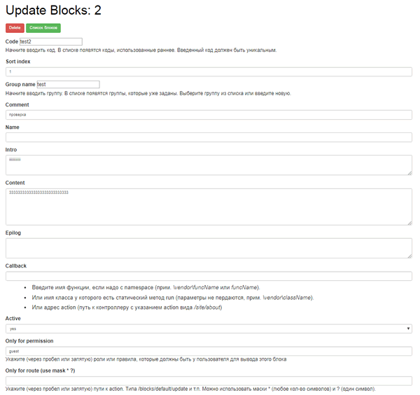

Blocks - module for Yii2
========================

The module is designed to display content blocks on the site. Blocks are created
in the database. Grouped by name. And sorted by index.

For example, you can organize a block of several banners under the site menu. Or
blocks of links in the footer of the site.

Block restriction on display is supported

-   by route

-   by role & rule

You can show guests one block, and administrators another.

\-----------------------------------------

Модуль предназначен для вывода на сайт блоков контента. Блоки создаются в базе
данных. Группируются по имени. И сортируются по индексу.

Например, можно организовать блок из нескольких баннеров под меню сайта. Или
блоки ссылок в футере сайта.

Поддерживается ограничение на показ каждого блока

-   по route

-   по правам доступа

Можно показать гостям один блок, а администраторам другой.

\-----------------------------------------

Install
=======

Use composer

~~~~~~~~~~~~~~~~~~~~~~~~~~~~~~~~~~~~~~~~~~~~~~~~~~~~~~~~~~~~~~~~~~~~~~~~~~~~~~~~
composer require "quanzo/yii2-blocks"
~~~~~~~~~~~~~~~~~~~~~~~~~~~~~~~~~~~~~~~~~~~~~~~~~~~~~~~~~~~~~~~~~~~~~~~~~~~~~~~~

or add in section *require* in *composer.json*

~~~~~~~~~~~~~~~~~~~~~~~~~~~~~~~~~~~~~~~~~~~~~~~~~~~~~~~~~~~~~~~~~~~~~~~~~~~~~~~~
"quanzo/yii2-blocks": "*"
~~~~~~~~~~~~~~~~~~~~~~~~~~~~~~~~~~~~~~~~~~~~~~~~~~~~~~~~~~~~~~~~~~~~~~~~~~~~~~~~

Install both db migrations.

Configure
---------

~~~~~~~~~~~~~~~~~~~~~~~~~~~~~~~~~~~~~~~~~~~~~~~~~~~~~~~~~~~~~~~~~~~~~~~~~~~~~~~~
$config = [
    'modules' => [
        'blocks' => [
            'class' => 'x51\yii2\modules\blocks\Module'
        ],
    ],
];
~~~~~~~~~~~~~~~~~~~~~~~~~~~~~~~~~~~~~~~~~~~~~~~~~~~~~~~~~~~~~~~~~~~~~~~~~~~~~~~~

Create role **blocks_manage** in rbac.

Add the role to the user who is allowed to edit.

How use
-------

~~~~~~~~~~~~~~~~~~~~~~~~~~~~~~~~~~~~~~~~~~~~~~~~~~~~~~~~~~~~~~~~~~~~~~~~~~~~~~~~
echo \x51\yii2\modules\blocks\widgets\Group::widget([
    'group' => 'sidebar', // group name
    'order' => 'ASC', // direction of sorting blocks in a group
    'before' => '', // output content before group
    'after' => '', // output content after group
    'beforeElement' => '', // display content before each element
    'afterElement' => '' // display content after each element
]);
~~~~~~~~~~~~~~~~~~~~~~~~~~~~~~~~~~~~~~~~~~~~~~~~~~~~~~~~~~~~~~~~~~~~~~~~~~~~~~~~

Picture
-------

